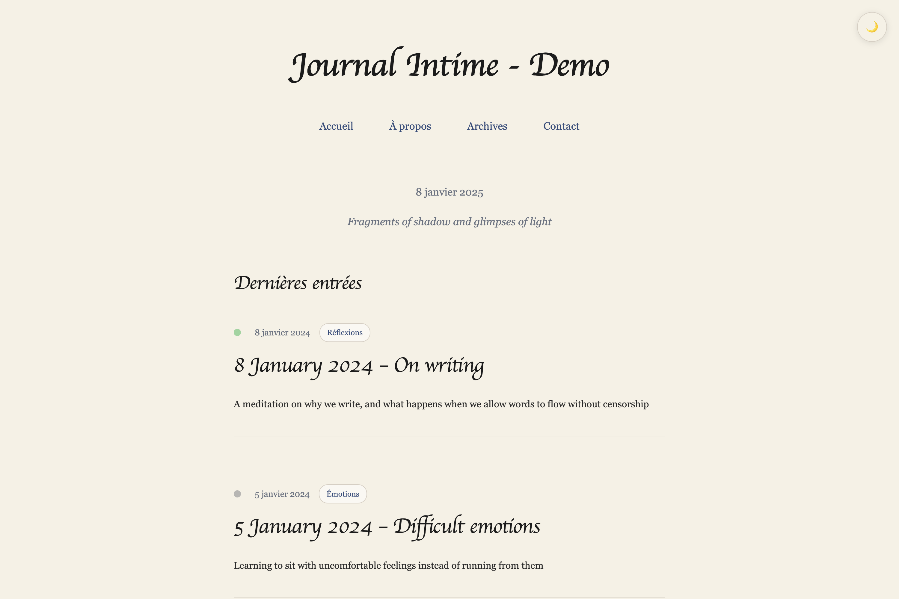

# Journal Intime - Hugo Theme

A warm, minimalist Hugo theme designed for intimate personal journaling, inspired by the aesthetics of a Moleskine notebook.



## ✨ Features

- **Moleskine-inspired design**: Warm ivory background with ink blue accents
- **Handwritten-style typography**: Caveat font for titles, Merriweather for body text
- **Dark mode toggle**: Comfortable nighttime writing with 🌙/☀️ button
- **Poetic categories**: Fragments, Émotions, Réflexions, Éclaircies
- **Mood indicators**: Subtle colored dots reflecting emotional states
- **Dated entries**: Format "DD Month YYYY – Title"
- **Related entries**: Intelligent recommendations
- **No visual distractions**: Zero transitions, hover effects, or animations
- **Mobile responsive**: Seamless experience across all devices

## 🚀 Quick Start

1. **Add the theme to your Hugo site**:

```bash
git submodule add https://github.com/a-lababsa/hugo-theme-journal.git themes/journal-intime
```

2. **Update your `hugo.toml`**:

```toml
theme = 'journal-intime'
languageCode = 'en' # or 'fr' for French
title = 'My Personal Journal'

[params]
  author = "Your Name"
  description = "Fragments of shadow and glimpses of light"
```

3. **Create your first entry**:

```bash
hugo new posts/01-january-2024-first-thoughts.md
```

## 📝 Writing Entries

### Entry Structure

```yaml
+++
date = '2024-01-01T20:00:00+01:00'
draft = false
title = "1 January 2024 – First thoughts"
categories = ["Fragments"]  # Choose from: Fragments, Émotions, Réflexions, Éclaircies
tags = ["reflection", "beginning", "hope"]
mood = "hopeful"  # hopeful, melancholic, peaceful, introspective, neutral
summary = "Starting this intimate writing journey..."
+++

Your personal thoughts and reflections here...
```

### Categories

- **Fragments**: Short notes, raw thoughts, captured moments
- **Émotions**: Texts about anxiety, joy, anger, tenderness
- **Réflexions**: Long, introspective entries and life meditations  
- **Éclaircies**: Moments of light, victories, instances of grace

## 🎨 Customization

### Color Palette

```css
:root {
    --bg-color: #F5F1E6;      /* Moleskine ivory */
    --text-color: #2B2B2B;    /* Dark gray text */
    --title-color: #1C1C1C;   /* Deep black titles */
    --link-color: #3A4E7A;    /* Ink blue links */
    --link-hover: #6A85B6;    /* Lighter blue hover */
}
```

### Dark Mode

Automatically adapts all colors for comfortable nighttime reading. Toggle persists between sessions.

## 📖 Philosophy

This theme embraces:

- **Intimacy over performance**: Authentic self-expression
- **Simplicity over complexity**: Minimal distractions
- **Warmth over coldness**: Human, approachable design
- **Respect for vulnerability**: Thoughtful content presentation

## 🌐 Demo

Visit the [live demo](https://a-lababsa.github.io/hugo-theme-journal) to see the theme in action.

## 📄 License

This theme is released under the [MIT License](LICENSE).

## 🤝 Contributing

Contributions are welcome! Please feel free to submit issues and pull requests.

---

*"We write to taste life twice, in the moment and in retrospection."* — Anaïs Nin
